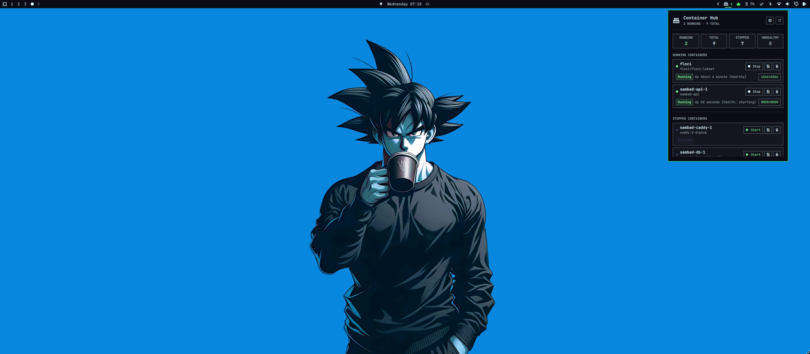
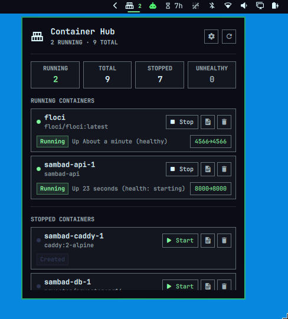

# Container Hub

The best Omarchy plugin for container monitoring: a clean bar panel for
watching and managing local containers without dropping to a terminal.

Container Hub is actively in development. The Docker MVP is done: listing,
status, ports, logs, start, stop, and remove are all working. Next up is
Podman support, followed by final polish, performance work, and reliability
optimizations.

## Preview





## Features

- Lists all Docker containers (running and stopped) with status and ports
- Start / stop / remove containers with one click
- View recent logs inline, or open the container in `lazydocker` for
  anything more involved
- Click a published port to open it in the browser
- Bar badge shows the running container count

Docker is supported now. Podman support is planned next.

## Install

This plugin lives directly under `~/.config/omarchy/plugins/container-hub/`.

```bash
git clone git@github.com:Suman196pokhrel/container-hub.git ~/.config/omarchy/plugins/container-hub
omarchy bar put io.github.suman196pokhrel.container-hub --section right
```

Requires the `docker` CLI on `PATH` and your user in the `docker` group
(`groups | grep docker`).

## Configuration

Available via Omarchy's plugin settings UI, or directly in
`~/.config/omarchy/shell.json`:

| Setting | Default | Description |
|---|---|---|
| `refreshIntervalOpenSec` | 3 | Poll interval while the panel is open |
| `refreshIntervalClosedSec` | 15 | Poll interval while the panel is closed |
| `logTailLines` | 200 | Lines fetched when viewing logs |

## Removal

```bash
omarchy plugin remove io.github.suman196pokhrel.container-hub
```

See [`docs/design.md`](docs/design.md) for the full design.

## License

MIT
